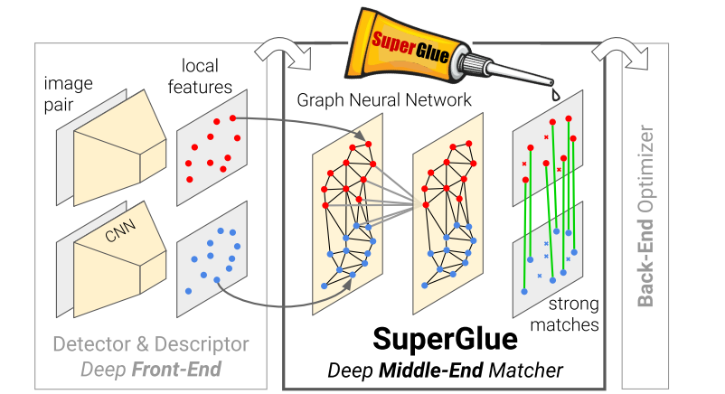

<h1 align="center"> Image Feature Matching </h1>

> "For most of us, our best camera is part of the phone in our pocket. We may take a snap of a landmark, like the Trevi Fountain in Rome, and share it with friends. By itself, that photo is two-dimensional and only includes the perspective of our shooting location. Of course, a lot of people have taken photos of that fountain. Together, we may be able to create a more complete, three-dimensional view. What if machine learning could help better capture the richness of the world using the vast amounts of unstructured image collections freely available on the internet?" [quote](https://www.kaggle.com/competitions/image-matching-challenge-2022)

## Data Description
- [data](data.md)
- ```download.sh``` to setup data (require ```~/.kaggle/kaggle.json```)

## Notebook
- Baseline: [](notebooks/baseline-loftr.ipynb)

## Methods
Due to the restriction of GPU resource, therefore only using pretrained-models method is experimented. All pretraining has been done for outdoor matching using MegaDepth dataset. 

1. **[LoFTR](models/LoFTR/README.md):** Detector-Free Local Feature Matching with Transformers
- Self and Cross Attention layers in Transformers are applied to obtain feature descriptors
<p align="center">
 <a></a>
Architecture from: <a>https://zju3dv.github.io/loftr/</a>
</p>

2. **[QuadTree Attention](models/QuadTree/README.md):** LoFTR-based with QuadTree Attention, which reduces the computational complexity from quadratic to linear.
- At each level, the top K patches with the highest attention scores are selected, such that at the next level, attention is only evaluated within the relevant regions corresponding to these top K patches. 
<p align="center">
 <a></a>
 Architecture from: <a>https://arxiv.org/pdf/2201.02767.pdf</a>
</p>


3. [SuperGlue Network](models/SuperGluePretrainedNetwork/README.md): Graph Neural Network combined with an Optimal Matching layer that is trained to perform matching on two sets of sparse image features.
- SuperGlue operates as a "middle-end," performing context aggregation, matching, and filtering in a single end-to-end architecture.

<p align="center">
 <a></a>
 Architecture from: <a>https://arxiv.org/pdf/1911.11763.pdf</a>
</p>

4. [DKM](models/DKM/README.md): Deep Kernelized Dense Geometric Matching
- Perform global fixed-size correlation, followed by flattening and convolution to predict correspondences. [Paper](https://arxiv.org/pdf/2202.00667.pdf)

## Result Examples
#### LoFTR with concatenated correspondence points from dual-softmax and optimal-transport pretrained-models on outdoor scenes
<p float="left">
   
</p>

#### LoFTR with correspondence points of augmented pair images from dual-softmax pretrained-model on outdoor scenes
<p float="left">
   
</p>

#### LoFTR with QuadTree Attention pretrained-models on outdoor scenes
<p float="left">
   
</p>

## Acknowledgements
Code adapted and used from:  
- LoFTR: https://github.com/zju3dv/LoFTR.
- SuperGlue: https://github.com/magicleap/SuperGluePretrainedNetwork.
- SE2-LoFTR: https://github.com/georg-bn/se2-loftr.
- DKM: https://github.com/Parskatt/DKM.
- QuadTree: https://github.com/Tangshitao/QuadTreeAttention

## Citations
```
@article{sun2021loftr,
  title={{LoFTR}: Detector-Free Local Feature Matching with Transformers},
  author={Sun, Jiaming and Shen, Zehong and Wang, Yuang and Bao, Hujun and Zhou, Xiaowei},
  journal={{CVPR}},
  year={2021}
}

@inproceedings{sarlin20superglue,
  author    = {Paul-Edouard Sarlin and
               Daniel DeTone and
               Tomasz Malisiewicz and
               Andrew Rabinovich},
  title     = {{SuperGlue}: Learning Feature Matching with Graph Neural Networks},
  booktitle = {CVPR},
  year      = {2020},
  url       = {https://arxiv.org/abs/1911.11763}
}

@article{tang2022quadtree,
  title={QuadTree Attention for Vision Transformers},
  author={Tang, Shitao and Zhang, Jiahui and Zhu, Siyu and Tan, Ping},
  journal={ICLR},
  year={2022}
}

@article{edstedt2022deep,
  title={Deep Kernelized Dense Geometric Matching},
  author={Edstedt, Johan and Wadenb{\"a}ck, M{\aa}rten and Felsberg, Michael},
  journal={arXiv preprint arXiv:2202.00667},
  year={2022}
}

@inproceedings{bokman2022se2loftr,
    title={A case for using rotation invariant features in state of the art feature matchers},
    author={B\"okman, Georg and Kahl, Fredrik},
    booktitle={CVPRW},
    year={2022}
}

@inproceedings{e2cnn,
    title={{General E(2)-Equivariant Steerable CNNs}},
    author={Weiler, Maurice and Cesa, Gabriele},
    booktitle={Conference on Neural Information Processing Systems (NeurIPS)},
    year={2019},
}

```
## References:
- Getting started with Image-Matching: [youtube](https://www.youtube.com/watch?v=S-UHiFsn-GI&list=PL2zRqk16wsdoCCLpou-dGo7QQNks1Ppzo)
- Kornia: https://github.com/kornia/kornia
- Coarse LoFTR: https://github.com/Kolkir/Coarse_LoFTR_TRT
- Patch2pix: https://github.com/GrumpyZhou/patch2pix.
- COTR: https://github.com/ubc-vision/COTR.
- MatchFormer: https://github.com/jamycheung/MatchFormer
